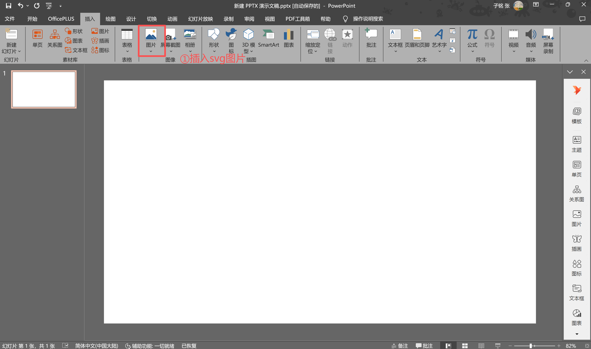
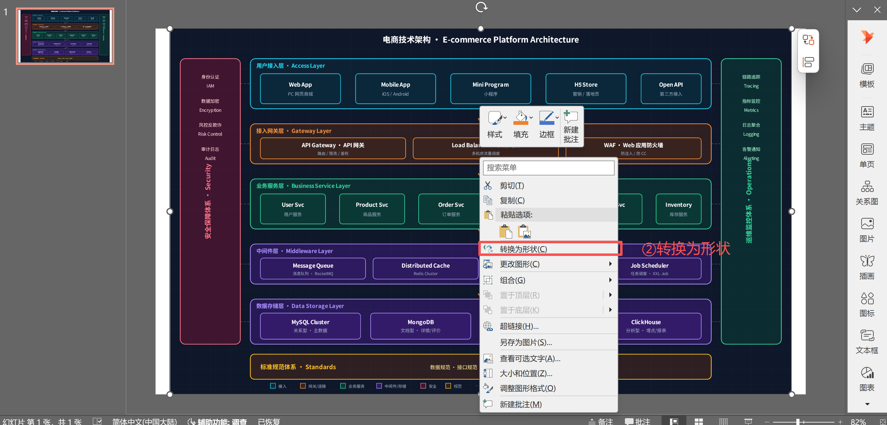
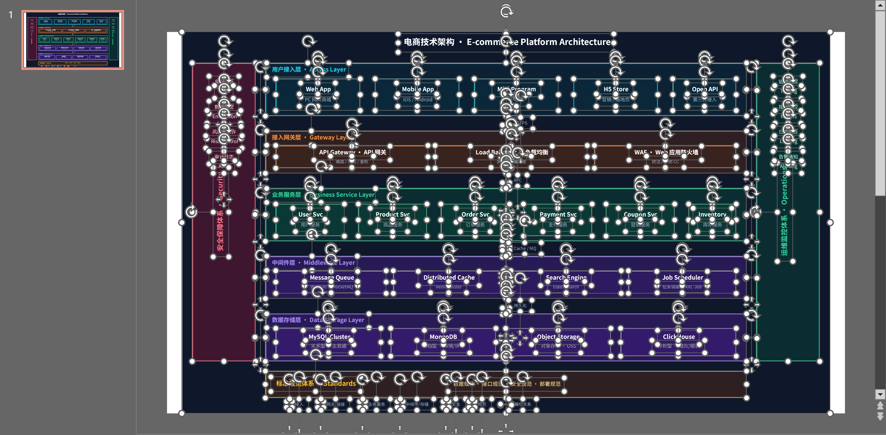

# renais-svg-arch · SVG 架构图生成器

一个 ZCode skill：**输入架构描述（文字 / Markdown / 文档），输出可直接粘进 PPT 并继续编辑的专业 SVG 架构图。** 纯 SVG 代码生成，不依赖外部 API。

最大的特点不是"画得好看"，而是**画出来的 SVG 在 PowerPoint / WPS 里能转换为可编辑形状**——不是一张死图，每个模块、每根线、每个字都能在 PPT 里继续改。

---

## 它能做什么

| 维度 | 能力 |
|------|------|
| **4 种风格** | dark-tech（暗色科技）/ light-tech（亮色清爽）/ civic-blue（政务商务）/ minimal-mono（黑白论文）|
| **4 种布局** | layered-stack（分层）/ flow-pipeline（流水线）/ hub-spoke（中心辐射）/ swimlane（泳道，支持横向+纵向）|
| **图标库** | 20 个高频架构图标（数据库 / 服务器 / 云 / 网关 / 缓存 / 队列 / 锁 / 监控 …）|
| **流程图元素** | 矩形步骤 / 菱形决策 / 椭圆起止 / 圆点汇聚 / 并行网关 / 回环虚线 |
| **引导式提问** | 根据输入完整度走 3 种模式（空白 / 模糊 / 详细），逐步问清需求，不会一上来就要一大段描述 |
| **流程细节追问** | 画流程图时主动追问判断分支 / 异常回退 / 阈值 / 起止，避免只画出"快乐路径"主线 |
| **PPT 兼容校验** | 内置校验脚本，生成后自动检查禁用特性 + 几何遮挡 + 线条溢出，不通过不交付 |

**组合能力**：4 风格 × 4 布局 = 16 种组合，覆盖绝大多数架构图场景。

---

## 适用场景

- **toB / 商务**：方案汇报、客户演示、投标文档、售前材料（用 civic-blue 显专业）
- **toC / 产品**：产品介绍、运营物料、对外宣发（用 dark-tech / light-tech 显科技感）
- **内部协作**：技术评审、架构文档、设计说明、专利附图（用 minimal-mono 显严谨）
- **嵌入 PPT 后微调**：转成形状后改文字、换配色、调位置，再发给客户或领导

> 核心价值：**生成 → 放进 PPT → 转形状 → 继续编辑**，全程不脱离 Office，交付物是"可二改的形状"，不是"死图片"。

---

## ★ 在 PPT 中转换为可编辑形状

这是本 skill 区别于普通画图工具的关键。生成的 SVG 放进 PowerPoint 后，能转换成原生 Office 形状，每个元素都可独立编辑。

### 操作步骤

**第 1 步：插入 SVG**
打开 PPT →「插入」→「图片」→ 选择生成的 `.svg` 文件。



**第 2 步：转换为形状**
选中图片 → 右键 →「**转换为形状**」(Convert to Shape)。PPT 会弹出确认框"是否转换为 Microsoft Office 绘图对象？"，点「是」。



**第 3 步：变为可编辑状态**
转换完成后，SVG 变成由多个子形状组成的组合。可以双击任意模块改文字、换颜色、调整大小；右键「组合 → 取消组合」可拆开逐个编辑。



### 为什么能做到

本 skill 生成 SVG 时**严格回避了 PPT 不支持的特性**（不用 `<marker>` 箭头、不用 `<filter>` 阴影、不用 `rgba()`、不用 `@import` 外部字体），全部用 PPT 能识别为形状的写法（显式 `<line>`+`<polygon>` 画箭头、偏移矩形模拟阴影、本地字体栈）。所以转换后形状不丢失、不错位。内置校验脚本会强制保证这一点。

### ⚠️ 流程图（泳道）在 PPT 中编辑难度较大

**分层架构 / 流水线 / 中心辐射**这三种布局，形状数量适中（5-15 个模块），转形状后在 PPT 里微调文字、配色、位置很方便。

但**泳道流程图**元素多（动辄 10+ 步骤 + 多个菱形决策 + 椭圆起止 + 连接线 + 图标 + 回环虚线），转换后形状数量大，在 PPT 里逐个手动调整（比如加一个步骤、改一个分支）非常费劲，还容易把连接线挪乱。

**建议**：
- 微调（改文字、换颜色）→ 在 PPT 里直接做
- **结构调整（加减步骤、改分支、改流程）→ 回到对话里重新描述需求，让 skill 重新生成**，比在 PPT 里硬改高效得多

---

## 优点

1. **PPT 可编辑**：转形状后每个元素可独立改，不是死图——这是最大卖点
2. **纯 SVG、零依赖**：生成的是文本代码，不依赖任何外部服务/API，可版本管理
3. **PPT 兼容有机器保证**：校验脚本拦在交付前，不会出现"粘进 PPT 箭头消失/阴影没了"的问题
4. **引导式交互**：不懂技术的人也能用，提问分模式、给选项，不用自己组织架构描述
5. **流程图会主动追问细节**：不只画主线，会把判断分支、异常路径、阈值问出来，图更完整
6. **多风格多布局**：一套描述能出不同视觉，适配商务/科技/论文等不同场合
7. **几何错误有兜底**：箭头遮挡、线条溢出这类"语法对但视觉错"的 bug，有专门的几何检测抓

## 缺点（诚实说明）

1. **复杂流程图 PPT 编辑难**：如上所述，泳道图元素多，转形状后手改费劲，建议对话重生成
2. **视觉效果有限**：为了 PPT 兼容，放弃了渐变阴影、发光、模糊等高级效果，视觉不如 Figma/Sketch 炫
3. **纯静态**：无交互、无动画、无悬停，只适合文档/演示，不适合做可交互原型
4. **需要 bun 环境**：校验脚本和 PNG 导出依赖 bun + sharp，纯生成 SVG 不需要
5. **图标库有限**：目前 20 个，遇到特殊组件（如 K8s pod、特定云服务）可能没有对应图标
6. **自动布局非完美**：复杂图（多回环、多跨道）偶尔仍会出现线条贴近、需要微调，校验能抓大部分但不保证 100%
7. **不支持从图片反向重画**：目前只能从文字描述生成，不能丢一张现有架构图截图让它重画

---

## 快速开始

这是一个 ZCode skill，放到 skills 目录后，直接对 AI 说：

```
画个架构图
```

AI 会引导你选布局、给内容、选风格，然后生成可校验的 SVG。

更具体的用法见 [`SKILL.md`](SKILL.md)（skill 的主流程说明）。

### 校验 & 导出 PNG（可选）

```bash
# 校验 SVG 的 PPT 兼容性（生成后必做）
bun scripts/validate-svg.ts arch-diagram/{你的图}/diagram.svg

# 导出 PNG（仅当需要图片格式时）
bun scripts/svg2png.ts arch-diagram/{你的图}/diagram.svg --scale 2 --output diagram@2x.png
```

---

## 文件结构

```
renais-svg-arch/
├── README.md                           # 本文件
├── SKILL.md                            # Skill 主流程（AI 读取）
├── references/                         # 设计规范 & 方法论
│   ├── styles/                         # 4 种视觉风格
│   │   ├── dark-tech.md
│   │   ├── light-tech.md
│   │   ├── civic-blue.md
│   │   └── minimal-mono.md
│   ├── layouts/                        # 4 种布局
│   │   ├── layered-stack.md
│   │   ├── flow-pipeline.md
│   │   ├── hub-spoke.md
│   │   └── swimlane.md                 # 含 6 种流程图节点形状
│   ├── icons.md                        # 20 个图标库
│   ├── structuring.md                  # 从自由文本抽取结构的方法
│   ├── interaction.md                  # 引导式提问闭环（3 模式）
│   ├── flow-detail.md                  # 流程图细节追问方法
│   └── svg/architecture.md             # 通用布局算法
├── scripts/
│   ├── validate-svg.ts                 # PPT 兼容 + 几何校验
│   └── svg2png.ts                      # SVG → PNG
└── arch-diagram/                       # 示例输出
    ├── ecommerce-platform/             # 分层架构 + 暗色科技
    ├── realtime-data-pipeline/         # 流水线 + 亮色
    ├── iam-center/                     # 中心辐射 + 政务蓝
    ├── order-flow/                     # 横向泳道 + 黑白论文
    ├── loan-approval/                  # 纵向泳道 + 亮色
    ├── overseas-refund/                # 退款流程（含菱形/回环）
    ├── saas-signup/                    # 注册流程（含多结束状态）
    ├── icon-preview/                   # 图标库预览
    └── ppt形状转换/                    # PPT 编辑步骤截图
```

---

## 示例效果

| 场景 | 布局 + 风格 | 预览 |
|------|------------|------|
| 电商技术架构 | layered-stack + dark-tech | `arch-diagram/ecommerce-platform/diagram.svg` |
| 实时数据管道 | flow-pipeline + light-tech | `arch-diagram/realtime-data-pipeline/diagram.svg` |
| 统一身份认证 | hub-spoke + civic-blue | `arch-diagram/iam-center/diagram.svg` |
| 海外退款流程 | swimlane（纵向）+ light-tech | `arch-diagram/overseas-refund/diagram.svg` |

> 所有示例都通过了 `validate-svg.ts` 校验，可直接粘进 PPT 转形状编辑。

---

## 技术依赖

- **生成 SVG**：无依赖，AI 直接写 SVG 代码
- **校验脚本**：[bun](https://bun.sh/)（运行 validate-svg.ts）
- **PNG 导出**：bun + [sharp](https://sharp.pixelplumbing.com/)

## License

MIT
